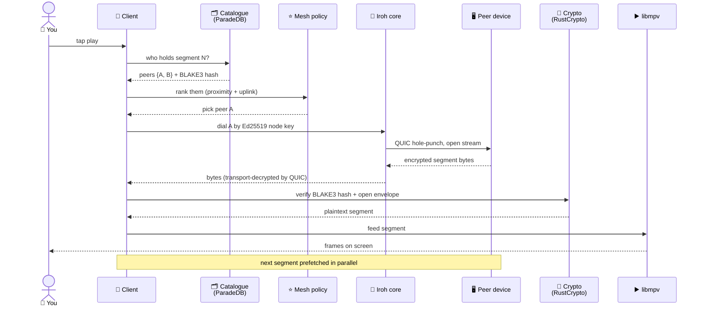
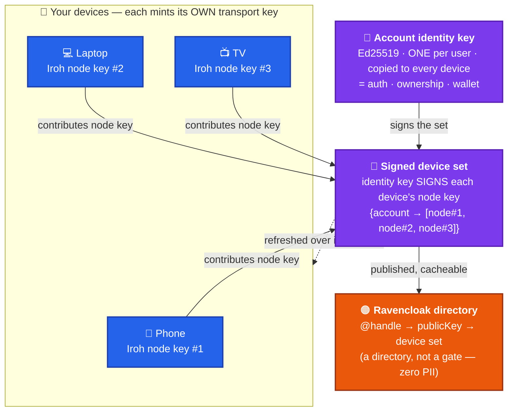
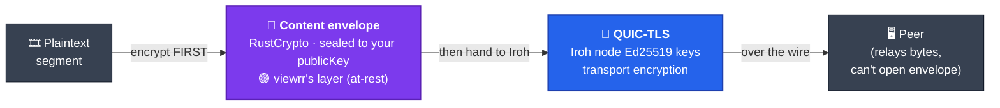
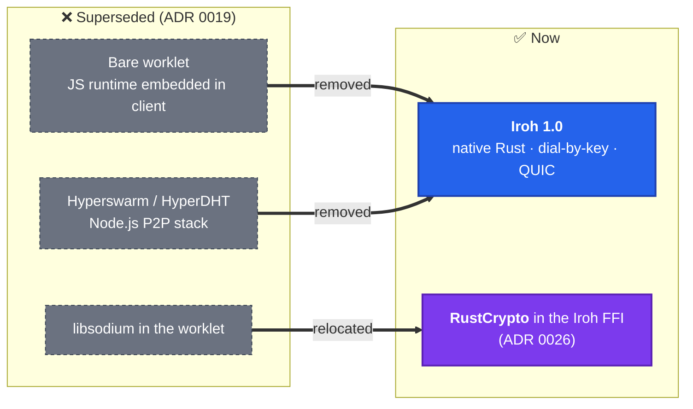

# viewrr — The P2P Mesh Stack, Layer by Layer

> A plain-English, OSI-style tour of how viewrr streams media peer-to-peer: every layer
> from the screen down to the wire, what library does the heavy lifting, and where
> viewrr's own code lives. If you read one architecture doc, read this one.

viewrr is a **peer-to-peer media mesh**: your devices fetch encrypted video segments
directly from other users' devices instead of a central CDN. A small neutral server
holds only a *catalogue* ("who has what") and a *directory* ("who is who") — it never
holds your keys and never sits on the playback path.

The stack below reads like the OSI model: **top = closest to the user (the screen),
bottom = closest to the wire (UDP packets).** The one thing to internalize:

> **Everything at the transport floor (dial, NAT, encryption, migration) is bought from
> [Iroh](https://www.iroh.computer). Everything that makes viewrr *viewrr* — peer
> selection, the device pool, the self-custody crypto envelope, the catalogue — is our
> own code. The library erases the plumbing so we can spend all our effort on the product.**

---

## Legend

Every box in the diagrams is colored by **who built it**:

| Color | Owner | Meaning |
|-------|-------|---------|
| 🟣 **Purple** | **viewrr own code** | The moat. Custom logic no library gives us. |
| 🔵 **Blue** | **Iroh** | Transport, discovery, NAT, wire crypto — bought, not built. |
| 🟢 **Teal** | **Mixed** | A library does the hard part; we write the thin glue. |
| 🟠 **Orange** | **Neutral infra** | Self-hosted server bits: catalogue, directory, relay. |

---

## 1. The whole stack at a glance

```mermaid
flowchart TB
    L9["<b>9 · Playback</b><br/>render AV1 HLS to screen<br/>📦 lib: <b>libmpv</b><br/>🟣 own: player shim · codec ladder · capture flags"]:::own
    L8["<b>8 · Content protection</b><br/>decrypt segment before it reaches the player<br/>📦 lib: <b>RustCrypto</b> (chacha20poly1305 · x25519 · hkdf · blake3)<br/>🟣 own: clear-key envelope · per-segment AES · seal-to-publicKey"]:::own
    L7["<b>7 · Catalogue &amp; availability</b><br/>who holds which segment · search · offline mirror<br/>📦 lib: <b>ParadeDB</b> (server) · <b>PowerSync</b> (client)<br/>🟢 own: schema · availability index · anti-poison gate"]:::mixed
    L6["<b>6 · Mesh policy</b> ⭐ THE PRODUCT<br/>choose the best peer · manage the device pool<br/>📦 lib: <b>none — all custom</b><br/>🟣 own: peer selection (Plus Code + uplink) · RF + LRU eviction · prefetch"]:::own
    L5["<b>5 · Segment transfer</b><br/>fetch one segment, integrity-verified<br/>📦 lib: <b>bao / BLAKE3</b> verified streaming<br/>🟢 own: request framing 'segment by hash' · resume · range"]:::mixed
    L4["<b>4 · Identity &amp; directory</b><br/>who you are · who owns what · reach a device<br/>📦 lib: <b>ed25519-dalek</b> · OS keystore<br/>🟣 own: challenge→verify auth · wallet model · signed device set · Ravencloak"]:::own
    L3["<b>3 · P2P core / transport</b><br/>dial a peer by key across NAT · encrypted streams · Wi-Fi↔cellular migration<br/>📦 lib: <b>Iroh 1.0</b> (iroh-ffi → Kotlin + Swift)<br/>🔵 own: expect/actual binding glue only"]:::iroh
    L2["<b>2 · Discovery</b><br/>resolve a public key to an address<br/>📦 lib: <b>Iroh</b> signed-DNS (default) · Mainline DHT (BEP44)<br/>🔵 own: self-host DNS records on VPS"]:::iroh
    L1b["<b>1b · NAT traversal / relay</b><br/>hole-punch coordination + data fallback<br/>📦 lib: <b>Iroh relay</b><br/>🔵 own: operate one relay on the VPS"]:::iroh
    L1a["<b>1a · Wire</b><br/>QUIC-TLS over UDP · swappable (Bluetooth / Tor later)<br/>📦 lib: <b>Iroh / quinn</b> + OS network stack<br/>🔵 own: none — Iroh owns transport crypto"]:::iroh

    L9 --> L8 --> L7 --> L6 --> L5 --> L4 --> L3 --> L2 --> L1b --> L1a

    classDef own fill:#7c3aed,color:#fff,stroke:#5b21b6,stroke-width:2px
    classDef iroh fill:#2563eb,color:#fff,stroke:#1e40af,stroke-width:2px
    classDef mixed fill:#0d9488,color:#fff,stroke:#0f766e,stroke-width:2px
```

**How to read it:** purple layers (6, 4, 8) are where viewrr's engineering lives. Blue
layers (3, 2, 1) are Iroh doing the hard networking so we don't. Layer 6 — mesh policy —
is the star: it has **zero** third-party library because *deciding which peer to pull
from* is the entire product.

---

## 2. Playing a video, end to end

What actually happens when you tap play — the request crosses every layer and comes
back as frames.

Two decryptions happen, and they're deliberately separate (see §4): **QUIC decrypts the
transport** (Iroh's job), then **the envelope decrypts the content** (our job). The peer
that served you the bytes never held the content key.

---

## 3. One identity, many devices — the key model

viewrr's identity is a **wallet model**: one Ed25519 key *is* your account, copied to all
your devices when you pair them. But Iroh dials a *node*, and a node needs its *own*
key — so a shared key would make your phone and laptop indistinguishable on the network.
The fix (ADR&nbsp;0025): **split auth identity from transport identity, bridge with a
signed device set.**

**Payoff:** "reach user U" resolves to U's current device node-keys; any peer verifies a
device really belongs to U by checking the account signature. Losing a phone? Drop it
from the set and re-sign — that device is off the mesh, and your identity key (your
wallet) is untouched on your other devices.

---

## 4. Two crypto seams — never confuse them

The single most important security invariant: **transport encryption and content
encryption are different layers, owned differently.** A peer relays your bytes but can
never read your content.

- **At-rest / content** (🟣 ours): the clear-key envelope — content key sealed to your
  `publicKey`, per-segment AES via HKDF. Runs in **RustCrypto inside the Iroh FFI**
  (ADR&nbsp;0026). This is self-custody: only *you* can open it.
- **Transport** (🔵 Iroh's): QUIC-TLS between node keys. Protects the hop, nothing more.

We encrypt the content **before** handing it to Iroh — so QUIC is just a tunnel for
already-sealed bytes.

---

## 5. What we replaced (and what's still lingering)

The mesh used to run a JavaScript runtime (Bare worklet) over the Hyperswarm/HyperDHT
stack. ADR&nbsp;0019 pivoted the whole transport floor to native Iroh.

> ⚠️ **Known debt:** some already-merged worklet code (PRs #122, #126) still targets the
> old Bare transport that Iroh replaces. It needs reconciling with the Iroh migration.

---

## 6. The layer table

| # | Layer (OSI-ish) | Does what | Library (3rd-party) | viewrr own logic | ADR |
|---|---|---|---|---|---|
| **9** | Playback | Render AV1 HLS | **libmpv** | player shim; codec ladder; capture flags | 0002 |
| **8** | Content protection | Decrypt at-rest before player | **RustCrypto** (chacha20poly1305, x25519-dalek, hkdf, blake3) | clear-key envelope; seal key→`publicKey`; per-segment AES | 0001, **0026** |
| **7** | Catalogue + availability | "Who holds segment X", search, sync | **ParadeDB**/pg_search · **PowerSync** | catalogue schema; availability index; anti-poison gate | 0008, 0018 |
| **6** | Mesh policy ⭐ | Pick peers, manage device pool | **none — custom** | peer selection (Plus Code + uplink); RF + LRU eviction; prefetch | 0009, 0011, 0016 |
| **5** | Segment transfer | Fetch one segment, verified | **bao/BLAKE3** | req/resp "segment by hash"; resume; range | 0016, 0019 |
| **4** | Identity + directory | Who you are; who owns what; reach a device | **ed25519-dalek**; OS keystore | challenge→verify auth; wallet model; signed device set; Ravencloak directory | 0013, 0025, 0006 |
| **3** | P2P core / transport | Dial by key across NAT; encrypted streams; migration | **Iroh 1.0** (iroh-ffi → Kotlin + Swift) | expect/actual binding glue | 0019 |
| **2** | Discovery | Resolve key → address | **Iroh** signed-DNS / Mainline DHT | self-host DNS records | 0019 |
| **1b** | NAT traversal / relay | Hole-punch coord + data fallback | **Iroh relay** (self-hosted) | operate relay on VPS | 0005, 0015 |
| **1a** | Wire | QUIC-TLS (Ed25519) over UDP; swappable | **Iroh/quinn** + OS net stack | none — Iroh owns it | 0019 |

---

## 7. Where to dig deeper (ADR index)

- [**0001**](https://github.com/viewrr/viewrr/blob/main/docs/adr/p2p-0001-self-custody-clearkey-no-hardware-drm.md) — self-custody clear-key content protection (no hardware DRM)
- [**0002**](https://github.com/viewrr/viewrr/blob/main/docs/adr/p2p-0002-compose-desktop-libvlc-drop-electron.md) — Compose Multiplatform client + libmpv player
- [**0005**](https://github.com/viewrr/viewrr/blob/main/docs/adr/p2p-0005-neutral-infrastructure-user-hosted.md) / [**0015**](https://github.com/viewrr/viewrr/blob/main/docs/adr/p2p-0015-vps-sole-infra-nas-demoted.md) — neutral, co-located VPS infrastructure
- [**0006**](https://github.com/viewrr/viewrr/blob/main/docs/adr/p2p-0006-private-discovery-topics-and-pairing.md) — Vault Link device pairing (the wallet model)
- [**0008**](https://github.com/viewrr/viewrr/blob/main/docs/adr/p2p-0008-central-catalog-mesh-contributed.md) — central catalogue (ParadeDB)
- [**0009**](https://github.com/viewrr/viewrr/blob/main/docs/adr/p2p-0009-peer-selection-proximity-uplink.md) — peer selection (Plus Code proximity + uplink)
- [**0011**](https://github.com/viewrr/viewrr/blob/main/docs/adr/p2p-0011-multi-device-storage-pool.md) — replication factor + LRU eviction across the device pool
- [**0013**](https://github.com/viewrr/viewrr/blob/main/docs/adr/p2p-0013-account-registry-ravencloak-directory-not-gate.md) — Ravencloak account directory (directory, not a gate)
- [**0016**](https://github.com/viewrr/viewrr/blob/main/docs/adr/p2p-0016-prepackaged-abr-hls-segment-p2p.md) — HLS segment = the P2P transfer unit
- [**0018**](https://github.com/viewrr/viewrr/blob/main/docs/adr/p2p-0018-client-sync-powersync.md) — PowerSync client-side catalogue mirror
- [**0019**](https://github.com/viewrr/viewrr/blob/main/docs/adr/p2p-0019-iroh-p2p-core.md) — **P2P core = Iroh** (the transport-floor pivot; supersedes the worklet)
- [**0025**](https://github.com/viewrr/viewrr/blob/main/docs/adr/p2p-0025-identity-key-vs-iroh-node-key-device-set.md) — identity key ≠ Iroh node key; signed device set
- [**0026**](https://github.com/viewrr/viewrr/blob/main/docs/adr/p2p-0026-crypto-in-iroh-ffi-post-worklet.md) — at-rest crypto moves into the Iroh Rust FFI

---

*Diagrams render live on GitHub (native Mermaid support). This doc is the map; the ADRs
in `docs/adr/` are the territory.*
